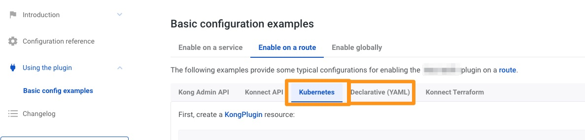

# Challenge 3 - create an API key

In [challenge 3](../3-create-api-key/README.md) you have activated api key based authentication and get denied by the gateway.

In this challenge now you create a consumer and associated it with an API key - which you then can use to access the service.

You might have solved this in previous challenge if you followed the documentation of the `key-auth` plugin to the end.

## Useful links

* [Key Authentication plugin](https://docs.konghq.com/hub/kong-inc/key-auth/how-to/basic-example/)

Each plugin's documentation has configuration examples - use the tab for `Kubernetes` (ingress controller) or `Declarative` to get example YAML files.

