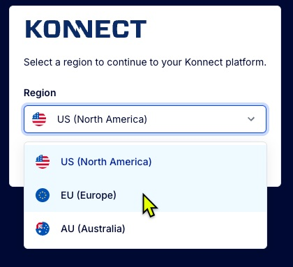
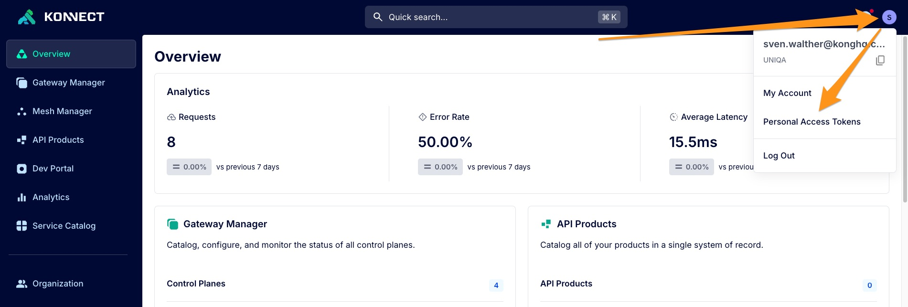

# Automation with decK

[decK](https://docs.konghq.com/kubernetes-ingress-controller/latest/) ("declarative configuration of Kong") is a tool to manage Kong configuration as code using YAML files. You can use decK to complete the challenges. 

## Getting started

If not already done install `decK` on your machine following the instructions at [https://docs.konghq.com/deck/latest/installation/](https://docs.konghq.com/deck/latest/installation/).

Log in to [Konnect](https://cloud.konghq.com/), choose the European server (if not already selected by default)



Now create a token for automation. To do so click on the blue circle on the upper right with your initials and choose `Personal Access Tokens`.



Create a new token and meomorize it (hint: put it into an environment variable called `KONNECT_TOKEN` on your machine).

Test if the connection to Konnect works by running the following command:

```shell
> export KONNECT_TOKEN=kpat_xxxxxxx # replace with your token
> deck gateway ping --konnect-addr "https://eu.api.konghq.com" --konnect-control-plane-name "gateway" --konnect-token $KONNECT_TOKEN

Successfully Konnected to the UNIQA organization!
```

Create an own unique username (all lowercase, no special characters or spaces - for example if your name is "John Doe" you could choose `johndoe`) and put it into an environment variable called `DECK_USERNAME`.

```shell
export DECK_USERNAME=johndoe
```